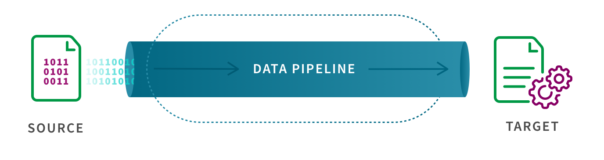
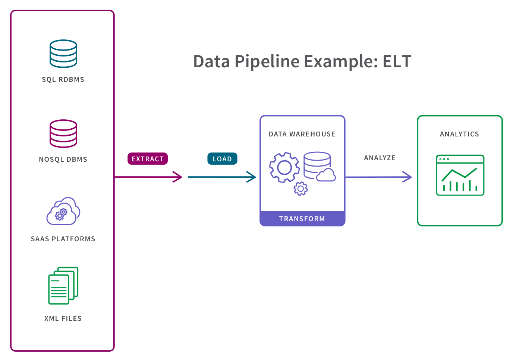

# ETL
OLTP, ETL, OLAP

In the realm of data management, two essential systems serve distinct purposes: OLTP (Online Transaction Processing) and OLAP (Online Analytical Processing). These systems are designed to handle different types of data and support various business needs. In this article, we will explore the differences between OLTP and OLAP and how the ETL (Extract, Transform, Load) process plays a vital role in bridging the gap between them.

## OLTP: The Engine of Transaction Processing
OLTP is a database management system optimized for handling day-to-day transactional operations. It is the backbone of operational processes, managing tasks like order processing, inventory management, and customer interactions. The primary focus of OLTP is to ensure data integrity and handle a large number of short, real-time transactions efficiently.

### Characteristics of OLTP:

Real-time processing of small, individual transactions.
Highly normalized data structure to reduce redundancy and improve data consistency.
Optimized for read and write operations in a concurrent environment.
Often involves complex relationships between tables to maintain data accuracy.

## OLAP: Empowering Analytical Insights
OLAP, on the other hand, is tailored for analytical processing and decision-making. Its purpose is to support complex queries and data analysis, enabling businesses to gain insights from large volumes of historical data. OLAP systems aggregate and summarize data, making it easier to perform data mining, generate reports, and support strategic decision-making.

### Characteristics of OLAP:

Designed for read-intensive operations, handling complex analytical queries.
Utilizes denormalized data structures (star or snowflake schemas) to enhance query performance.
Stores historical data for analysis and trend identification.
Enables multidimensional analysis, often involving slicing and dicing data along multiple dimensions.
ETL: The Mediator between OLTP and OLAP
While OLTP and OLAP serve different purposes, they are interconnected in the data management ecosystem. This is where ETL comes into play - acting as a mediator to bridge the gap between the two systems.

The Extract, Transform, Load (ETL) process involves three main stages:

- Extract: Data is collected from various sources, such as databases, spreadsheets, or APIs. In an OLTP scenario, this data is often transactional and stored in relational databases.

- Transform: The extracted data is then transformed to match the data structure and requirements of the OLAP system. This process involves cleaning, filtering, aggregating, and performing other data manipulations.

- Load: Finally, the transformed data is loaded into the OLAP system, which could be a data warehouse or a specialized OLAP database. This data is now ready for in-depth analysis and generating insights.

## ETL Pipeline Use Cases
By converting raw data to match the target system, ETL pipelines allow for systematic and accurate data analysis in the target repository. So, from data migration to faster insights, ETL pipelines are critical for data-driven organizations. They save data teams time and effort by eliminating errors, bottlenecks, and latency to provide for a smooth flow of data from one system to the other. Here are some of the primary use cases:

- Enabling data migration from a legacy system to a new repository.
- Centralizing all data sources to obtain a consolidated version of the data.
- Enriching data in one system, such as a CRM platform, with data from another system, such as a marketing automation platform.
- Providing a stable dataset for data analytics tools to quickly access a single, pre-defined analytics use case given that the data set has already been structured and transformed.
- Complying with GDPR, HIPAA, and CCPA standards given that users can omit any sensitive data prior to loading in the target system.
- Using ETL data pipelines in these ways breaks down data silos and creates a single source of truth and a complete picture of a business. Users can then apply BI tools, create data visualizations and dashboards to derive and share actionable insights from the data.
  
## What is a Data Pipeline?
The terms “ETL pipeline” and “data pipeline” are sometimes used synonymously, but they shouldn’t be. Data pipeline is an umbrella term for the category of moving data between systems and an ETL data pipeline is a particular type of data pipeline.

A data pipeline is a process for moving data between a source system and a target repository. More specifically, data pipelines involve software which automates the many steps that may or may not be involved in moving data for a specific use case, such as extracting data from a source system, then transforming, combining and validating that data, and then loading it into a target repository.

For example, in certain types of data pipelines, the “transform” step is decoupled from the extract and load steps:

Like an ETL pipeline, the target system for a data pipeline can be a database, an application, a cloud data warehouse, a data lakehouse, a data lake or data warehouse. This target system can combine data from a variety of sources and structure it for fast and reliable analysis.

## Conclusion:

OLTP and OLAP are two crucial components in the data management landscape, serving distinct purposes in handling transactions and enabling analytical insights, respectively. The ETL process acts as a bridge, facilitating the seamless flow of data between these systems. By understanding the differences between OLTP and OLAP and appreciating the role of ETL, businesses can optimize their data management strategies, unlocking the full potential of their data for better decision-making and strategic planning.
