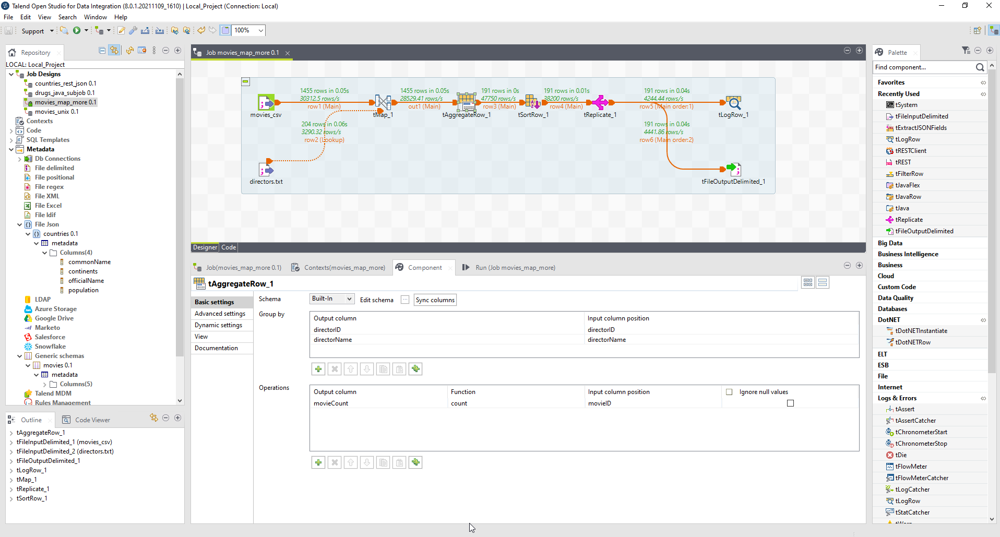
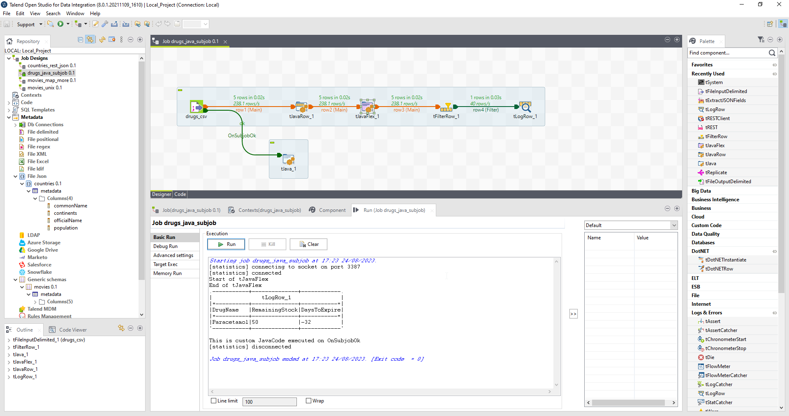
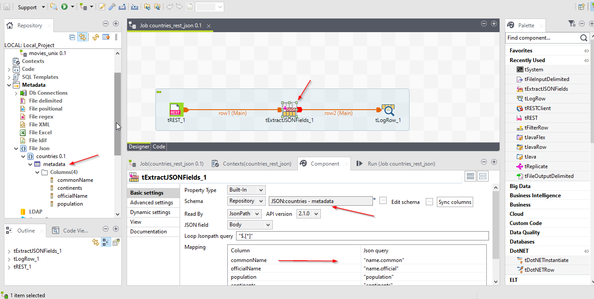

# Talend
Talend, a powerful ETL (Extract, Transform, Load) tool, empowers businesses to streamline their data workflows and make informed decisions. In this tutorial, we will walk you through the essential steps of using Talend to integrate, cleanse, and load data, highlighting its user-friendly interface and robust capabilities.

## How to?
### Getting Started: Installation and Setup
To begin your journey with Talend, the first step is to download and install the Talend Studio application. Once installed, launch the application and create a new project. Talend Studio offers a graphical development environment with drag-and-drop components, making it easy for users with varying technical backgrounds to work seamlessly.

### Defining Data Sources: Extracting Data
The first stage of the ETL process is extracting data from various sources. Talend provides a wide range of connectors for databases, cloud services, files, and more. Using the "tFileInput" or "tInputExcel" components, you can easily configure the data source and extract data into Talend.

### Data Transformation: Cleaning and Enriching Data
With the data extracted, the next step is transforming it to suit your analysis requirements. Talend offers a vast array of transformation components, allowing users to clean, validate, and enrich the data. For example, you can use the "tMap" component to perform data mapping and apply business rules to cleanse the data.

### Data Integration: Combining Multiple Sources
Talend's strength lies in its ability to integrate data from multiple sources seamlessly. The "tJoin," "tMap," and "tDenormalize" components enable you to merge data from various sources based on specified keys. This integration facilitates a comprehensive view of data, empowering users to perform in-depth analysis.

### Data Loading: Loading Data into Target
Once data extraction and transformation are complete, the final step is loading the processed data into the target destination. Talend offers components like "tFileOutput" and "tOutputExcel" for writing data to files and "tOutputDB" for loading data into databases. Talend's parallel processing capabilities ensure efficient and optimized loading of large datasets.

### Scheduling and Automation
Talend provides automation features that allow you to schedule your ETL jobs to run at specific intervals. The built-in scheduler ensures that your data pipelines are executed at the right time, reducing manual intervention and ensuring data accuracy.

## Tutorials:
### Tutorial 1 - extract, map, load etc
- Files 
    - [movies.csv](./assets/movies.csv)  ';' delimited
    - [directors.txt](./assets/directors.txt) ',' delimited
- Goal: Use these files to get list of directors with number of movies made in descending order of count, output to console as well as to a file    
    

### Tutorial 2 - java
- Files 
    - [drugs.csv](./assets/drugs.csv)  ';' delimited
- Goal: Use this file to get list of drugs and use tJavaRow, tJavaFlex to calculate DaysToExpire and RemainingStock and filter only the expired one. 
    

### Tutorial 3 - rest, json
- Goal:  Use this url "https://restcountries.com/v3/all" to get list of all the countries in the world and extract Common name, Official name, population, continents
    